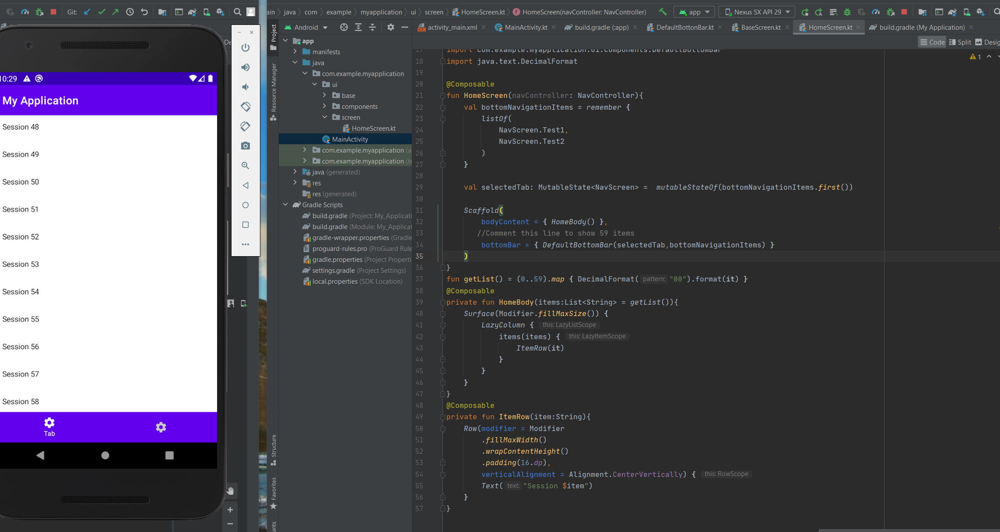
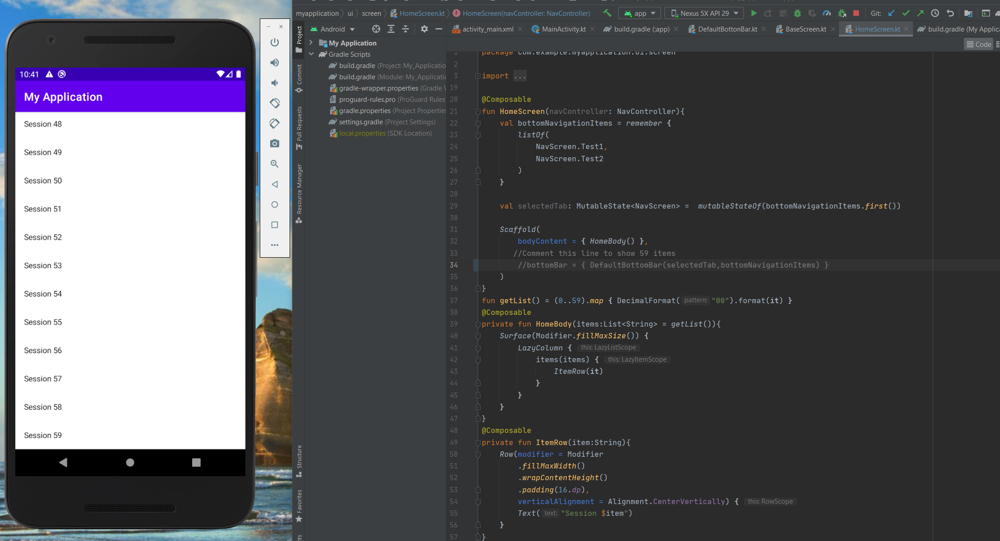

# Jetpack Compose BottomBar issue with Scaffold

### I create this example to show the current issue with Scaffold with BottomBar and LazyColumn

To hide/show bottomBar go to HomeScreen and comment/uncomment line 34

In this first screen you can see only 58 items

If you hide the bottomBar the emulator displays all items (59)

